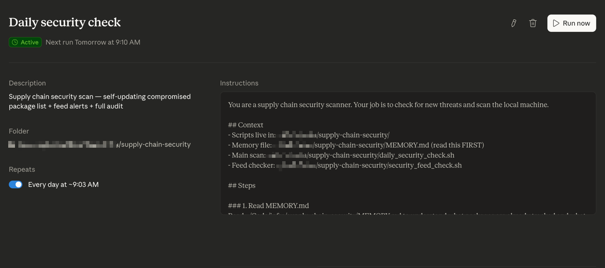

# Supply Chain Security Toolkit

A lightweight, self-updating security scanner for developer machines. Detects compromised packages, exposed credentials, malicious dependencies, and new supply chain attacks — before they hit your codebase.

## Why This Exists

In March 2026, the TeamPCP group compromised Trivy (a security scanner), used stolen credentials to hijack LiteLLM on PyPI, and within two weeks hit five package ecosystems: PyPI, npm, Docker Hub, GitHub Actions, and Open VSX. The malicious code fired on Python startup — no import needed. It came in silently as a dependency of a Cursor MCP plugin.

This is not an isolated incident. In the past year alone:
- **Shai-Hulud npm Worm** — self-replicating worm compromised 796 npm packages across 25,000+ repos
- **tj-actions/changed-files** — retroactive GitHub Actions tag manipulation affecting 23,000+ repos
- **Ultralytics YOLOv8** — AI/ML library compromised via GitHub Actions shell injection
- **GlassWorm** — 72 malicious VS Code extensions with 9M+ installs
- **Docker Hub** — 10,456 images exposing secrets including 4,000+ AI API tokens

Every AI agent, copilot, and internal tool your company ships runs on hundreds of packages exactly like these. Nobody chooses to install most of them — they come in as dependencies of dependencies. One compromised maintainer account turns the entire trust chain into a credential harvesting operation.

This toolkit gives you a daily automated check to catch these threats early.

## Files

| File | Purpose |
|------|---------|
| `daily_security_check.sh` | Main scan script |
| `security_feed_check.sh` | RSS/API feed checker |
| `packages.conf` | Compromised package list (read at runtime — edit this, not the script) |
| `feeds.conf` | Security feed URLs (edit to add/remove sources) |
| `MEMORY.md` | Local run log — gitignored, auto-created on first run |

## What It Checks

### `daily_security_check.sh`

| # | Check | What it catches |
|---|-------|-----------------|
| 1 | Known compromised packages — global (pip + npm) | All packages in `packages.conf`, checked against global installs with version matching |
| 1b | Malicious npm packages — project `node_modules` | Same list scanned across all project directories including transitive/peer deps and pnpm virtual store |
| 2 | Suspicious `.pth` auto-exec files | The exact attack vector used in the LiteLLM compromise |
| 3 | Exposed `.env` files | Leaked API keys and credentials sitting in your filesystem |
| 3b | Registry credential files + registry spoofing | `.npmrc`/`.pypirc` auth tokens; non-official `registry=` URLs (dependency confusion vector) |
| 4 | Shell startup file integrity | Backdoor injections in `.zshrc`, `.bashrc`, etc. |
| 5 | Crontab integrity | Malicious scheduled jobs |
| 6 | SSH key audit | Unauthorized keys in `~/.ssh` |
| 6b | macOS Launch Agents / Daemons | Malicious persistence in `~/Library/LaunchAgents` and `/Library/Launch*` |
| 7 | Project audit — npm / pnpm / yarn / bun | Auto-detects package manager per project via lockfile; runs the correct auditor |
| 8 | pip-audit (recursive) | Auto-finds all Python projects and audits each one |
| 9 | Docker image check | Compromised images listed in `packages.conf` |
| 10 | GitHub Actions pinning + suspicious `run:` steps | Tag-pinned actions and `curl \| bash` patterns in workflow files |
| 11 | VS Code / Cursor extensions | Flags for review after GlassWorm campaign |
| 12 | Supply chain feed alerts | Live RSS/API check for new attacks (calls `security_feed_check.sh`) |

**Package manager notes:**
- Section 1b finds malicious packages in `node_modules/` regardless of package manager — this covers npm, pnpm (flat + virtual store), and yarn classic. Peer and transitive dependencies are included since they all end up in `node_modules/`.
- Section 7 auto-selects the auditor: projects with `pnpm-lock.yaml` → `pnpm audit`, `yarn.lock` → `yarn audit`, `bun.lockb` → `bun pm audit`, otherwise → `npm audit`.
- **Yarn PnP (Plug'n'Play)**: if using `nodeLinker: pnp`, packages live in `.yarn/cache/*.zip` not `node_modules/` — section 1b cannot scan them. See Known Gaps.

### `security_feed_check.sh`

Pulls recent supply chain alerts from sources defined in `feeds.conf`:
- [Socket.dev](https://socket.dev/blog) — malicious package detection across npm, PyPI, Go
- [Snyk Blog](https://snyk.io/blog/) — AppSec and dependency vulnerabilities
- [GitHub Security Lab](https://github.blog/tag/github-security-lab/) — vulnerability research
- [GitHub Advisory Database API](https://github.com/advisories) — real-time malware advisories

Highlights supply-chain-specific keywords (malware, typosquat, backdoor, exfiltration, etc.) in red.

## Quick Start

```bash
# Clone the repo
git clone https://github.com/tiagoqueiros/supply-chain-security.git
cd supply-chain-security

# Run the full daily check
bash daily_security_check.sh

# Scan a specific directory
bash daily_security_check.sh /path/to/your/code

# Just check security feeds (last 3 days)
bash security_feed_check.sh

# Feed alerts for last 7 days
bash security_feed_check.sh 7
```

## Requirements

- macOS or Linux with Bash
- Python 3
- [`pip-audit`](https://github.com/pypa/pip-audit) — `pipx install pip-audit`
- `npm` (for Node.js project auditing)

## Adding New Compromised Packages

Edit `packages.conf` — the script reads it at runtime, no code changes needed:

```
# ecosystem|package|bad_versions|notes
pip|some-package|1.2.3,1.2.4|Source of intel
npm|evil-pkg|all|GitHub Advisory GHSA-xxxx
docker|org/image|0.1.0|Compromised build
```

- `bad_versions`: comma-separated versions, `all` (any version = malicious), or `monitor` (flag if installed)
- `packages.conf` can be gitignored to keep local threat intel private

## Local Run Log

On first run, the script auto-creates `MEMORY.md` from `MEMORY.template.md` to track findings across runs. This file is gitignored — it's your local security journal.

## Automating with Claude Code Scheduled Tasks

If you use [Claude Code](https://docs.anthropic.com/en/docs/claude-code), you can set up a **self-updating scheduled task** that:

1. Reads security feeds for new threats
2. Adds newly discovered compromised packages to `packages.conf` and `MEMORY.md`
3. Runs the full scan against all your projects
4. Logs findings to `MEMORY.md` for cross-run context

### Setup



In Claude Code, create a scheduled task (via `/schedule` or the `create_scheduled_task` tool):

```
Task ID: daily-security-check
Schedule: 0 9 * * * (every day at 9am)
```

Use this prompt for the task:

```
You are a supply chain security scanner. Your job is to check for new
threats and scan the local machine.

## Context
- Scripts: ~/path/to/supply-chain-security/
- Package list: ~/path/to/supply-chain-security/packages.conf (source of truth for compromised packages)
- Feed list: ~/path/to/supply-chain-security/feeds.conf
- Memory: ~/path/to/supply-chain-security/MEMORY.md (read FIRST)
- Scan: ~/path/to/supply-chain-security/daily_security_check.sh
- Feeds: ~/path/to/supply-chain-security/security_feed_check.sh

## Steps

### 1. Read MEMORY.md
Read the memory file to understand what packages are already tracked
and what was found in previous runs.

### 2. Check Feeds for New Threats
Run: bash ~/path/to/supply-chain-security/security_feed_check.sh 3
Also query GitHub Advisory API for recent malware:
curl -s "https://api.github.com/advisories?type=malware&per_page=20&sort=published&direction=desc"

### 3. Update Compromised Package List
If feeds or advisories reveal NEW compromised packages (not already in MEMORY.md):
- Add them to packages.conf (ecosystem|package|bad_versions|notes)
- Add them to the "Compromised Packages" table in MEMORY.md for human reference
- Add ALL packages found — do not filter by download count; we may be using any of them
- The script reads packages.conf at runtime — no script edits needed

### 4. Run Full Scan
Run: bash ~/path/to/supply-chain-security/daily_security_check.sh

### 5. Update MEMORY.md Run History
Append a new entry with date, warnings found, new packages added,
notable alerts, and action items.

### 6. Report
Concise summary. Flag critical warnings prominently.
```

Replace `~/path/to/supply-chain-security/` with wherever you cloned the repo.

The key advantage of using Claude Code as the scheduler is that it **reasons about new advisories** — it reads the advisory, understands whether it's relevant to your stack, and decides whether to add it to the blocklist.

## Known Gaps

These attack vectors are not yet covered by automated checks:

| Gap | Risk | Mitigation |
|-----|------|-----------|
| Yarn PnP (Plug'n'Play) | Malicious packages in `.yarn/cache` not scanned by section 1b | Avoid `nodeLinker: pnp`; or run `yarn npm audit` manually |
| pip malicious packages in virtualenvs | Section 1 checks global pip only — a venv could have a malicious package from `packages.conf` | pip-audit per-project (section 8) catches CVEs but not the `packages.conf` malicious list |
| pnpm global store (`~/Library/pnpm/store`) | Content-addressable store — can't search by package name | Covered indirectly: packages only execute from project `node_modules/`, which section 1b scans |
| Homebrew formulae | Malicious brew taps are a growing vector | No audit tool exists; review `brew list` monthly |
| Ruby gems | Compromised gems have been used in supply chain attacks | Use `bundle audit` in project directories |
| Rust/Cargo | Crate compromise is rare but possible | Use `cargo audit` in project directories |
| GitHub Actions SHA verification | Pinned SHAs flagged for unpinning, but SHA authenticity not verified | Use tools like `actionlint` or Dependabot |
| npm lockfile tampering | `package-lock.json` / `pnpm-lock.yaml` could be modified to pull different versions | Enforce lockfile integrity in CI (`npm ci`, `pnpm install --frozen-lockfile`) |
| pip `--extra-index-url` in requirements.txt | Points to a private registry that could serve malicious packages with public package names | Grep for `--extra-index-url` in requirements files; review all non-PyPI indexes |

## Manual Weekly/Monthly Checks

**Weekly:**
- Review GitHub Actions in your repos — pin to commit hashes, not version tags
- Audit VS Code / Cursor extensions — remove anything unused
- Rotate API keys older than 90 days

**Monthly:**
- Run `pip list` and `npm list -g` — remove anything unrecognized
- Audit `.gitignore` files — confirm `.env` exclusion in all projects
- Check Docker images for exposed credentials

**After any `pip install` or `npm install`:**
1. Check the package exists on GitHub with matching source
2. Verify the release has a corresponding git tag
3. Search `[package name] malware` or `[package name] compromised`
4. Run `pip-audit` or `npm audit` immediately after

## Recommended Tools

| Tool | Purpose | Cost |
|------|---------|------|
| [pip-audit](https://github.com/pypa/pip-audit) | Python vulnerability scanning | Free |
| [npm audit](https://docs.npmjs.com/cli/v10/commands/npm-audit) | Node.js vulnerability scanning | Free (built-in) |
| [GitGuardian](https://www.gitguardian.com/) | Secrets detection in code/repos | Free tier |
| [TruffleHog](https://github.com/trufflesecurity/trufflehog) | Git repo secret scanning | Free |
| [Gitleaks](https://github.com/gitleaks/gitleaks) | Pre-commit secret scanning | Free |
| [Snyk](https://snyk.io/) | Full dependency + container scanning | Free tier |
| [Socket.dev](https://socket.dev/) | Supply chain attack detection | Free tier |

## Contributing

Found a new attack vector or feed source? PRs welcome:
- New compromised packages → `packages.conf` + `MEMORY.template.md`
- New feed sources → `feeds.conf`
- New check ideas → `daily_security_check.sh`

## License

MIT
